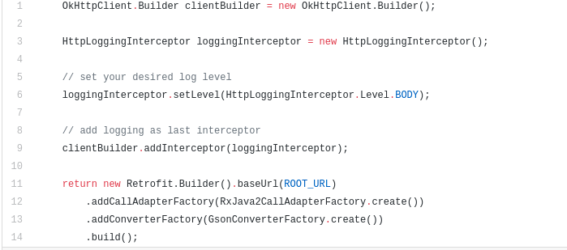
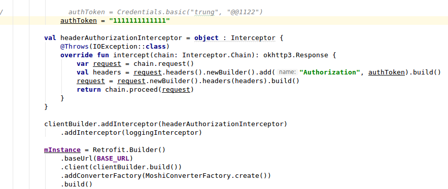
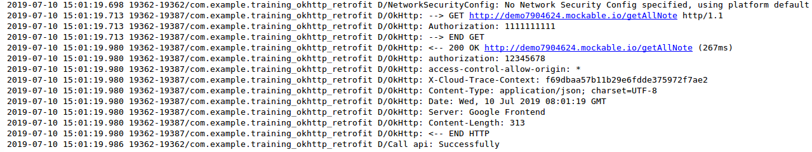
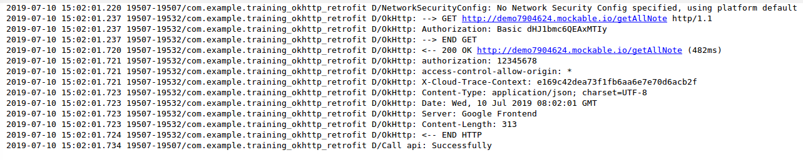
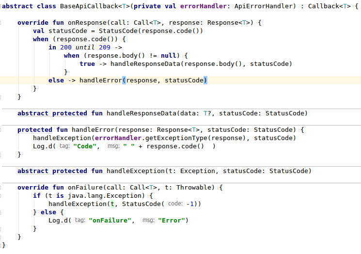
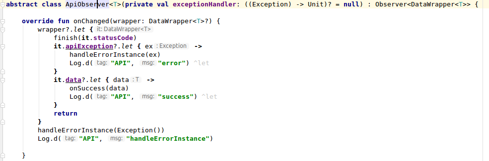
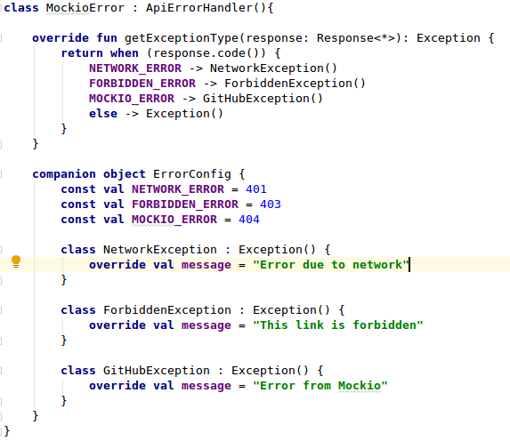
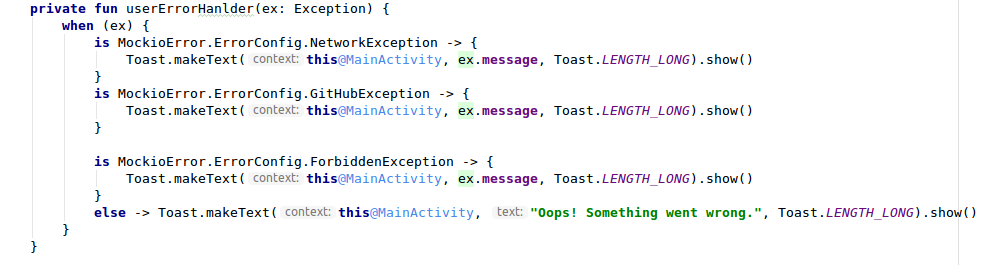
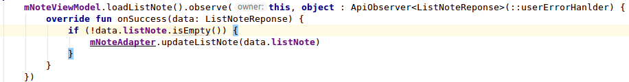

# Retrofit

## I. Các khái niệm

### 1. Retrofit là gì ?

**Retrofit** là một type-safe HTTP client cho Android và Java. Retrofit giúp dễ dàng kết nối tới một dịch vụ REST ở trên web bằng cách dịch API thành các Interface của Java

Thư viện mạnh mẽ này giúp bạn lấy dữ liệu trả về dạng JSON hoặc XML, sau đó phần tích cú pháp thành Plain Old Java Objects (POJOs). Các request **GET, POST, PUT, PATCH, DELETE** đều có thể được thực thi 

Retrofit được xây dựng trên nền một số thư viện mạnh mẽ và công cụ khác, đằng sau nó có sử dụng OkHttp.
Ngoài ra Retrofit không tích hợp sẵn bộ chuyển đổi JSON -> Java, thay vào đó ta có thể sử dụng các thư viện sau:

Gson: com.squareup.retrofit:converter-gson

Jackson: com.squareup.retrofit:converter-jackson

Moshi: com.squareup.retrofit:converter-moshi

Vs Protocol buffers, Retrofit hỗ trợ

Protobuf: com.squareup.retrofit2:converter-protobuf

Wire: com.squareup.retrofit2:converter-wire

Và đối với XML, Retrofit hỗ trợ:

Simple Framework: com.squareup.retrofit2:converter-simpleframework

### 2. Tại sao lại dùng Retrofit ?

- Retrofit đơn giản trong việc setup và sử dụng : phát triển thư viện type-safe HTTP của riêng của bạn để giao tiếp với một REST API có thể thật sự rất khó: bạn phải xử lý nhiều khía cạnh, chẳng hạn như kết nối, bộ nhớ đệm, thử lại yêu cầu sai, luồng, phân tích phản hồi, xử lý lỗi và nhiều thứ khác. Mặt khác, Retrofit là một thư viện được tổ chức tốt, tài liệu hướng đầy đủ và đã thử nghiệm sẽ giúp bạn tiết kiệm rất nhiều thời gian quý báu và những đau đầu không cần thiết.

- Retrofit là một type-safe HTTP client: trình biên dịch sẽ xác nhận hợp lệ các kiểu dữ liệu trong khi biên dịch và ném một lỗi nếu bạn cố gán kiểu sai cho một biến.

- Retrofit nhanh hơn rất nhiều so với việc sử dụng Volley, AysncTask


### 3. OkHttp Interceptor

### a. Khái niệm

Một trong những việc rất nhàn chán khi phát triển ứng dụng trên nền tảng Android đó là xử lý kết nối mạng, bắt lỗi và exception, kiểm soát kích thước file download và thời gian download file đó...vv.

Interceptor có nghĩa là “làm can thiệp một cái gì đó trong việc đến được đích đến của nó”, tương tự như nghĩa của nó Interceptor can thiệp vào một request, thay đổi request đó và sau đó gửi lại đến điêm đến của nó (server).

Các Interceptor là để quan sát, điều chỉnh và có khả năng chặn các request và những phản hồi. Thông thường các Interceptor thực hiện thêm, xóa , chuyển đổi các Headers trên request hoặc trên các phản hồi được trả về (từ server).

### b. Tác dụng

- Kiểm soát kết nối tới server

- Kiểm soát các kết nối không tốt và thử kết nối lại khi có thể

- Nó sẽ thử thay thế server IP address nếu kết nối tới một IP nào đó bị thất bại vào IP thay thế được chuẩn bị sẵn

- Giảm độ trễ của request, giảm size của file cần download

- Tránh lặp lại các request đã được hoàn thành

### c. Những phần sẽ tìm hiểu

- **Logging Interceptor**: log ra các lịch sử và tình trạng của các request/response. Những logs này sẽ cho chúng ta biết về headers, request/response body và chi tiết quan trọng cho việc debug và sửa các lỗi

Trong HttpLoggingInterceptor.Level có các param :

+ Level.BASIC : log ra những dòng request/response

+ Level.BODY: log ra những dòng, và header và body tương ứng (nếu có)

+ Level.HEADERS: logs ra những dòng và header tương ứng với nó

+ Level.NONE : không log ra gì cả

- **Authorization Header**: add thông tin cho API request, ví dụ như add authen token

- **Authen cơ bản**: xác thực một cách cơ bản, vẫn request vs Authorization Header chứa từ "Basic" và đằng sau là khoảng trắng, sau đó là username:password được đưa về dạng string base 64

- SSL Configuration: mặc định thì Retrofit không kết nối được tới API mà được bảo vệ vs SSL, vậy nên ta cần phải cấu hình cho nó.

### 4.

Hiểu về enqueue()

enqueue() gửi yêu cầu và thông báo cho ứng dụng của bạn một cách không đồng bộ với một hàm callback khi có một phản hồi. Vì yêu cầu này là không đồng bộ, nên Retrofit xử lý việc thực thi trên một tác vụ chạy nền vì thế mà Giao diện Người dùng không bị ảnh hưởng.

Để sử dụng phương thức enqueue(), bạn phải cài đặt hai phương thức callback: onResponse() và onFailure(). Chỉ có một trong hai phương thức này sẽ được gọi để đáp ứng một yêu cầu nhất định.

**onResponse()**: được gọi khi nhận được một phản hồi HTTP. Phương thức này được gọi khi có một phản hồi mà có thể được xử lý một cách chính xác ngay cả khi máy chủ trả về một thông báo lỗi. Vì vậy nếu bạn nhận được một code trạng thái là 404 hoặc 500, phương thức này sẽ vẫn được gọi. Để có được code trạng thái để bạn xử lý các tình huống dựa trên chúng, bạn có thể sử dụng phương thức response.code(). Bạn cũng có thể sử dụng phương thức isSuccessful() để tìm ra code trạng thái trong khoảng 200-300, xác định một yêu cầu thành công.

**onFailure()**: được gọi khi một ngoại lệ kết nối mạng xảy ra trong quá trình giao tiếp đến máy chủ, hoặc khi một ngoại lệ bất ngờ xảy ra trong quá trình xử lý yêu cầu hoặc xử lý phản hồi.

Các yêu cầu đồng bộ

Để thực hiện một yêu cầu đồng bộ, bạn có thể sử dụng phương thức execute() trong một đối tượng Call. Nhưng lưu ý rằng các phương thức đồng bộ trên tác vụ chính/UI sẽ chặn bất kỳ hành động nào của người dùng. Vì vậy, đừng thực hiện các phương thức đồng bộ trên tác vụ chính/UI của Android! Thay vào đó, hãy chạy chúng trên một tác vụ nền.

### 5. Xử lý lỗi với LiveData và Retrofit


Vấn đề hay xảy ra là phải kiểm tra lại nhiều lần mỗi khi nhận response từ server như


- response.body() khác null


- Check nếu có exception được thown thì phải xử lý, nếu ko thì cho hiển thị lên view


==> Cần có code base để xử lý các vấn đề này


## II. Code


### 1. Logging Interceptor


-  Add compile 'com.squareup.okhttp3:logging-interceptor:3.8.0' vào file build.gradle của app.


- Thêm đoạn code add logging





- Kết quả


### 2. Authorization Header

-  Tạo đối tượng Interceptor bằng request header

- Add đối tượng đó tới OkHttpClient.Builder 





- Kết quả





### 3. Basic Authentication

-  Tạo authen key bằng hàm của class Credential

```
authToken = Credentials.basic("trung", "@@1122")
```

- Add đối tượng đó tới OkHttpClient.Builder 


- Kết quả





### 4. Xử lý lỗi với LiveData và Retrofit


- Extend lại lớp CallBack để có những xử lý riêng





- Extend lại lớp Observer để có những xử lý khi dữ liệu thay đổi, khi thành công, khi có lỗi, ...





- Liệt kê danh sách các lỗi cần xử lý 





- Xử lý các lỗi 





-Observe tới custom observer ở trên





